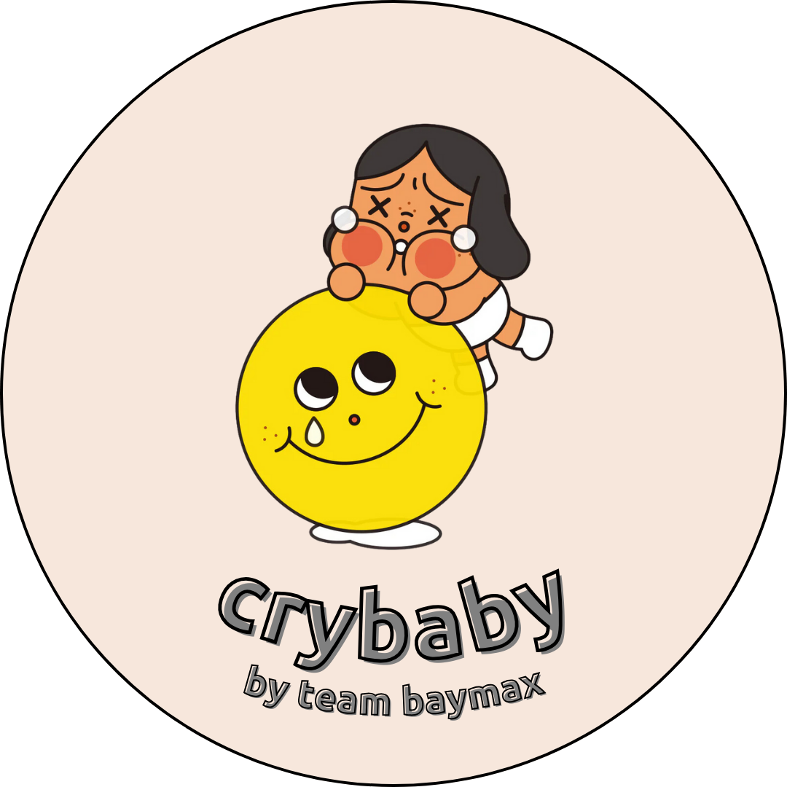
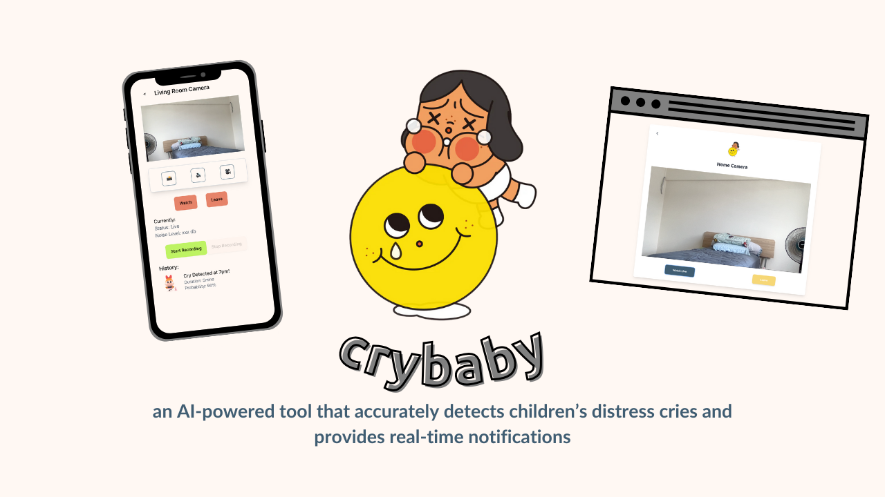
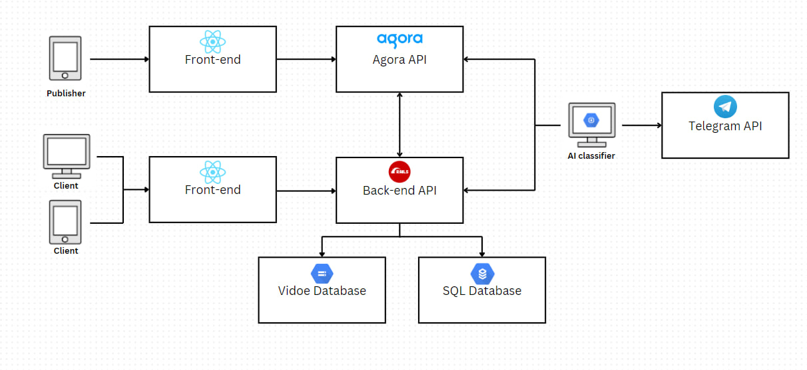

<!-- Improved compatibility of back to top link: See: https://github.com/othneildrew/Best-README-Template/pull/73 -->
<a id="readme-top"></a>


<!-- PROJECT LOGO -->
<br />
<div align="center">
  <a href="https://github.com/github_username/repo_name">
    
  </a>

<h3 align="center">crybaby</h3>

  <p align="center">
    project_description
    <br />
    <a href="https://sites.google.com/mymail.sutd.edu.sg/teambaymax/home?authuser=4"><strong>Visit our website »</strong></a>
    <br />
    <br />
    <a href="https://youtu.be/L2SNQhx0_Yo">Introduction To Team</a>
    ·
    <a href="https://youtu.be/L2SNQhx0_Yo">Product Video</a>
  </p>
</div>


<!-- TABLE OF CONTENTS -->
<details>
  <summary>Table of Contents</summary>
  <ol>
    <li>
      <a href="#about-the-project">About The Project</a>
      <ul>
        <li><a href="#built-with">Built With</a></li>
      </ul>
    </li>
    <li>
      <a href="#getting-started">Getting Started</a>
      <ul>
        <li><a href="#prerequisites">Prerequisites</a></li>
      </ul>
    </li>
    <li><a href="#usage">Usage</a></li>
    <li><a href="#roadmap">Roadmap</a></li>
    <li><a href="#contributing">Contributing</a></li>
    <li><a href="#license">License</a></li>
    <li><a href="#acknowledgments">Acknowledgments</a></li>
  </ol>
</details>


<!-- ABOUT THE PROJECT -->
## About The Project

<p align="center">
<a href="readme_img/cover_pic.png">
  
</a>
</p>

This project is a web application built with Ruby on Rails. It includes a PostgreSQL database and Docker for containerization. The application is designed to manage tasks, providing features such as user authentication, task creation, and progress tracking.
<p align="right">(<a href="#readme-top">back to top</a>)</p>


### Built With

Frontend:

[![React][React.js]][React-url]

Backend:

[![Rails][Rails]][Rails-url]
[![Python][Python]][Python-url]
[![Google Cloud][GoogleCloud]][GoogleCloud-url]

<p align="right">(<a href="#readme-top">back to top</a>)</p>


<!-- GETTING STARTED -->
## Getting Started

This is an example of how you may give instructions on setting up your project locally.
To get a local copy up and running follow these simple example steps.

### Prerequisites

- **Ruby version**: 3.2.4
- **Rails version**: 7.1.3
- **Docker version**: 20.10.7
- **PostgreSQL version**: 13

<p align="right">(<a href="#readme-top">back to top</a>)</p>

## Key Dependencies
The project uses several key dependencies, including:

- Rails 7.1.3
- PostgreSQL
- Docker
- RSpec for testing
- Webpacker for managing JavaScript
- Turbo and Stimulus for modern Rails development
- Python: ^3.10, <3.12
- Poetry Dependencies Manager for Python

<p align="right">(<a href="#readme-top">back to top</a>)</p>

For a complete list of dependencies, please refer to the `Gemfile` in the project repository.

<!-- USAGE EXAMPLES -->
## Usage

### User Usage
1. **Register**: Users can register to create an account.
2. **Get the settings from Agora API**: Configure the streaming settings using the Agora API.
3. **Stream**: Start a live stream.
4. **Watch**: View live streams.
5. **Record Stream**: Record streams and save them to history.
6. **Join Telegram Channel**: Get notified when a baby crying is detected.
7. **View History**: Access manually recorded videos or automatically recorded videos when a baby cries, arranged by dates.

**Clone the repository:**
    ```bash
    git clone https://github.com/Service-Design-Studio/1d-final-project-summer-2024-sds-2024-team-09.git
    ```

#### Main Backend
1. **Change directory to the repository:**
    ```bash
    cd 1d-final-project-summer-2024-sds-2024-team-09
    ```
2. **Install dependencies for rails**:
    ```bash
    bundle install
    ```
3. **Set up the database:**
    ```bash
    rails db:create
    rails db:migrate
    rails db:seed
    ```
4. **Run the Rails server**:
    ```bash
    rails server
    ```
5. **Build and run the Docker container: (deploy the program onto a cloud platform)**
    ```bash
    docker-compose up --build
    ```
<p align="right">(<a href="#readme-top">back to top</a>)</p>


#### Front-end
1. **Change directory to the repository:**
    ```bash
    cd 1d-final-project-summer-2024-sds-2024-team-09
    ```
2. **Install dependencies for React**:
    ```bash
    npm install
    ```
3. **Run executes the dev script for React**:
    ```bash
    npm run dev
    ```
    or deploy the program onto a cloud platform.

#### AI feature
1. **Installation**:
    ```bash
    cd 1d-final-project-summer-2024-sds-2024-team-09/ai_feature
    poetry install
    ```
2. **Set up `baby_cry_AI`**:
    - make a copy of example.env and fill up the necessary fields, including huggingface token and agora token
    - additionally fill in agora token in ai_feature/recording_interval_updated/recording_interval_updated/templates/index.html
    - setup Google Cloud SQL proxy https://cloud.google.com/sql/docs/mysql/sql-proxy
4. **Run the recorder for AI detection**:
      **Change directory to the repository**:

        ```
        cd ai_feature
        ```
     **Connect to GCLoud SQL**:

        ```
        ./cloud_sql_proxy [your project id]:[your project region]:[your gcloud sql]-sql -p 5432
        ```
     **Run detection for AI**:

        ```
        make run
        ```
     **Run recording function for detection**:

        ```
        cd recording_interval_updated/recording_interval_updated
        python to_record.py
        ```
3. **Ensure Connectivity**:
    - Verify that all components (backend, AI system, front-end) are properly connected and communicating.

<p align="right">(<a href="#readme-top">back to top</a>)</p>


## Architecture
<br />
<div align="center">
  <a href="https://github.com/github_username/repo_name">
    
  </a>

<!-- LICENSE -->
## License

This project is licensed under the CryBaby License. 

### CryBaby License

CryBaby License

Copyright (c) [2024] [CryBaby]

Permission is hereby granted, free of charge, to any person obtaining a copy
of this software and associated documentation files (the "Software"), to deal
in the Software without restriction, including without limitation the rights
to use, copy, modify, merge, publish, distribute, sublicense, and/or sell
copies of the Software, and to permit persons to whom the Software is
furnished to do so, subject to the following conditions:

The above copyright notice and this permission notice shall be included in all
copies or substantial portions of the Software.

THE SOFTWARE IS PROVIDED "AS IS", WITHOUT WARRANTY OF ANY KIND, EXPRESS OR
IMPLIED, INCLUDING BUT NOT LIMITED TO THE WARRANTIES OF MERCHANTABILITY,
FITNESS FOR A PARTICULAR PURPOSE AND NONINFRINGEMENT. IN NO EVENT SHALL THE
AUTHORS OR COPYRIGHT HOLDERS BE LIABLE FOR ANY CLAIM, DAMAGES OR OTHER
LIABILITY, WHETHER IN AN ACTION OF CONTRACT, TORT OR OTHERWISE, ARISING FROM,
OUT OF OR IN CONNECTION WITH THE SOFTWARE OR THE USE OR OTHER DEALINGS IN THE
SOFTWARE.

<p align="right">(<a href="#readme-top">back to top</a>)</p>


<!-- ACKNOWLEDGMENTS -->
## Acknowledgments

For any inquiries, questions, or issues, please feel free to contact our team:

- [Tan Jing Kai]
  - Email: [jingkai_tan@mymail.sutd.edu.sg]
  - GitHub: [https://github.com/jingkai27]
- [Lee Jya Yin]
  - Email: [jyajin_lee@mymail.sutd.edu.sg]
  - GitHub: [https://github.com/jyayin]
- [Xiong Qian Long Mike]
  - Email: [mike_xiong@mymail.sutd.edu.sg]
  - GitHub: [https://github.com/mikexql]
- [Sofeanna Binte Yusof]
  - Email: [sofeanna_yusof@mymail.sutd.edu.sg]
  - GitHub: [https://github.com/Sofeanna17]
- [Lim Sophie]
  - Email: [sophie_lim@mymail.sutd.edu.sg]
  - GitHub: [https://github.com/shmoope]
- [Lim Sing Thai Tiger]
  - Email: [Tiger_Lim@mymail.sutd.edu.sg]
  - GitHub: [https://github.com/Regitiger]

<p align="right">(<a href="#readme-top">back to top</a>)</p>


<!-- MARKDOWN LINKS & IMAGES -->
<!-- https://www.markdownguide.org/basic-syntax/#reference-style-links -->
[contributors-shield]: https://img.shields.io/github/contributors/github_username/repo_name.svg?style=for-the-badge
[contributors-url]: https://github.com/github_username/repo_name/graphs/contributors
[forks-shield]: https://img.shields.io/github/forks/github_username/repo_name.svg?style=for-the-badge
[forks-url]: https://github.com/github_username/repo_name/network/members
[stars-shield]: https://img.shields.io/github/stars/github_username/repo_name.svg?style=for-the-badge
[stars-url]: https://github.com/github_username/repo_name/stargazers
[issues-shield]: https://img.shields.io/github/issues/github_username/repo_name.svg?style=for-the-badge
[issues-url]: https://github.com/github_username/repo_name/issues
[license-shield]: https://img.shields.io/github/license/github_username/repo_name.svg?style=for-the-badge
[license-url]: https://github.com/github_username/repo_name/blob/master/LICENSE.txt
[linkedin-shield]: https://img.shields.io/badge/-LinkedIn-black.svg?style=for-the-badge&logo=linkedin&colorB=555
[linkedin-url]: https://linkedin.com/in/linkedin_username
[product-screenshot]: images/screenshot.png
[React.js]: https://img.shields.io/badge/-React-61DAFB?logo=react&logoColor=white&style=for-the-badge
[React-url]: https://reactjs.org/

[Rails]: https://img.shields.io/badge/-Rails-CC0000?logo=ruby-on-rails&logoColor=white&style=for-the-badge
[Rails-url]: https://rubyonrails.org/

[Python]: https://img.shields.io/badge/-Python-3776AB?logo=python&logoColor=white&style=for-the-badge
[Python-url]: https://www.python.org/

[GoogleCloud]: https://img.shields.io/badge/-Google%20Cloud-4285F4?logo=google-cloud&logoColor=white&style=for-the-badge
[GoogleCloud-url]: https://cloud.google.com/

Data sources include:
[Ubenwa CryCeleb2023](https://huggingface.co/datasets/Ubenwa/CryCeleb2023)
[ESC-50 Dataset for environmental sound classification](https://dagshub.com/kinkusuma/esc50-dataset), also featuring non-crying samples
Audio clips downloaded from YouTube, such as [this one](https://www.youtube.com/watch?v=lmbJP1yObZc)
Friends who were willing to record there babies crying

Preprocessing
The raw audio files were processed into 4-second Mel Spectrogram clips using [Librosa](https://librosa.org/doc/0.10.1/generated/librosa.feature.melspectrogram.html#librosa.feature.melspectrogram), which provides a two-dimensional representation of the sound based on the [mel-scale frequencies](https://en.wikipedia.org/wiki/Mel_scale).
The preprocessing routine is integral to Cry Baby's runtime operations and is available [here](./cry_baby/pkg/audio_file_client/adapters/librosa_client.py).

Model architecture
The model's architecture is inspired by the design presented in [this research paper](https://www.pacet-conf.gr/Files/PACET2022paper194.pdf). Below is a visualization of the model structure:


Training and evaluation
Training was conducted over 10 epochs with a batch size of 32. The corresponding training and validation loss and accuracy metrics are illustrated below.

